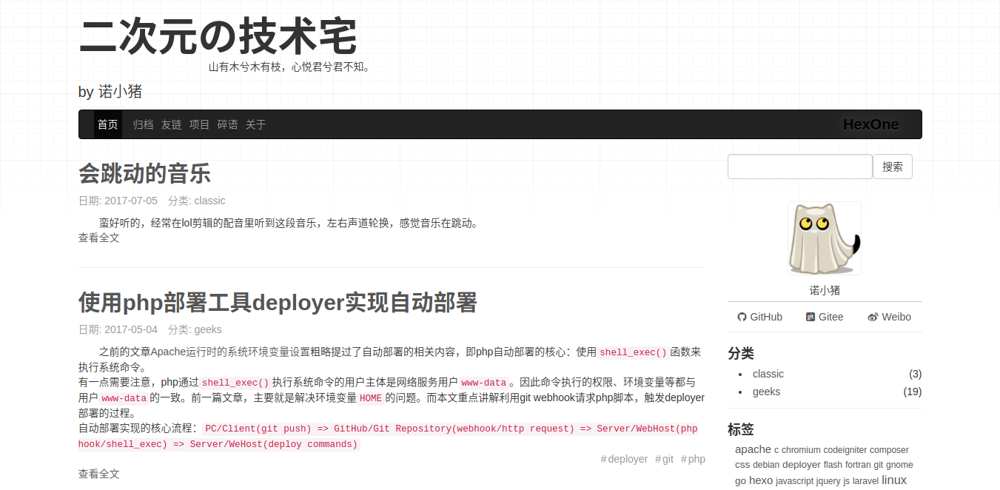
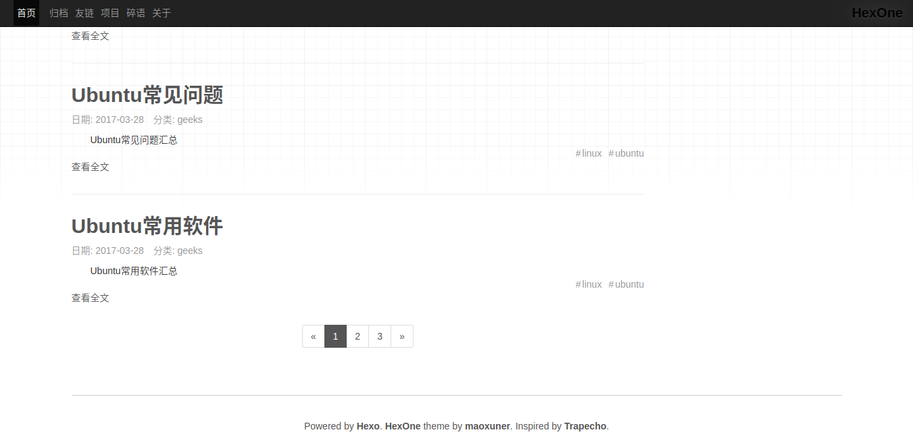
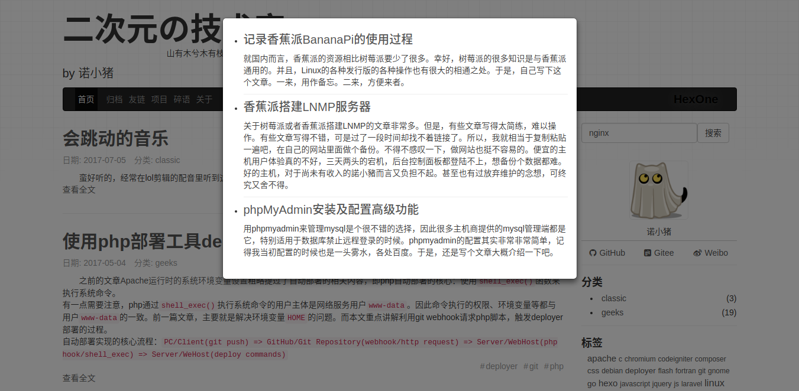
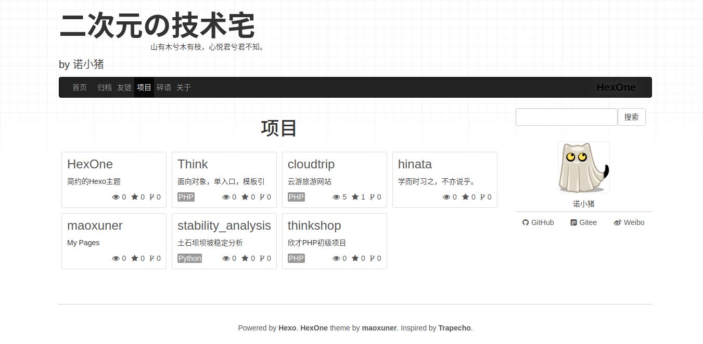
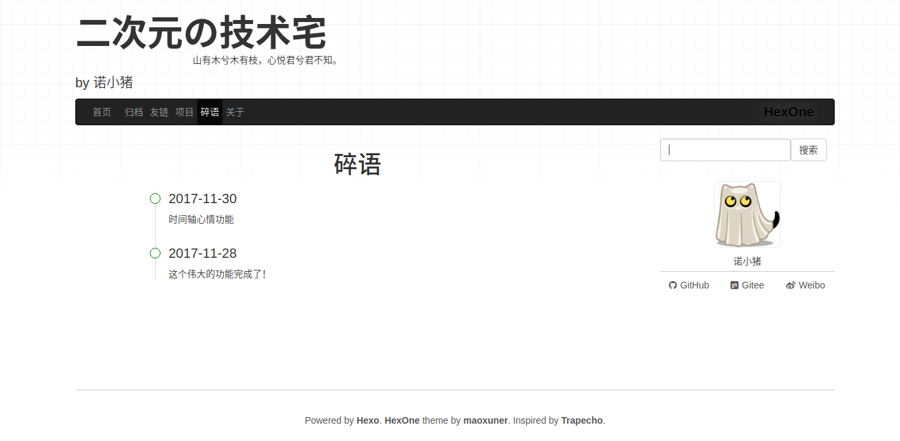

# HexOne

简约的[Hexo](https://hexo.io/)主题[HexOne](https://gitee.com/maoxuner/hexo-theme-hexone/)（仿[Trapecho](http://blog.gregwym.info/)）



## 安装

### 依赖

- css预处理器less
- rss订阅生成
- json内容生成

```bash
npm install hexo-renderer-less --save
npm install hexo-generator-feed --save
npm install hexo-generator-json-content --save
```

**注意**

- `hexo-renderer-less`涉及到样式文件的生成，必须安装
- `hexo-generator-feed`与rss订阅相关，不安装不能生成`atom.xml`文件
- `hexo-generator-json-content`与文章搜索功能相关，不安装不能搜索文章

### 文件

复制[source/pages](source/pages)整个目录到文章源码目录`source/`下（该目录下有`_posts`）。

**注意**

- 如果这几个页面的`permalink`与已有页面重复，需要修改对应的`permalink`以及菜单内容
- 如果不执行该操作，将无法使用项目展示、心情等功能

## 特色

### 导航条置顶

滚动页面后导航条置顶



### 文章搜索

站内搜索

站内搜索使用了`hexo-generator-json-content`插件来生成文章内容的json文件。相比于搜索引擎搜索，这个方案能够搜索到站内的所有文章和单页，但是会消耗一定的带宽。生成文章时，该插件会一定程度上增加处理的时间，目前看来影响并不大。



### 开源项目展示

只支持[码云](https://gitee.com/)开源项目的展示。如果要支持[Github](https://github.com/)等，可修改[source/js/main.js](source/js/main.js)文件中的相关代码。



### 心情

有时候只是想三言两语说说自己的心情，不想每次都创建一篇文章，但是又想有个好的展示效果。于是便有了这个功能——心情，类似于说说/微博的功能。修改对应的文章（source/pages/moods.md），按照json格式添加即可。



## 备注

该主题仅仅是为了满足我自己的需求，会及时修复漏洞、进行优化，但是不会做更多功能的开发。
